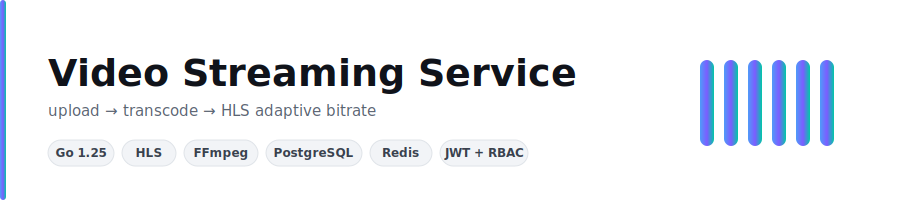
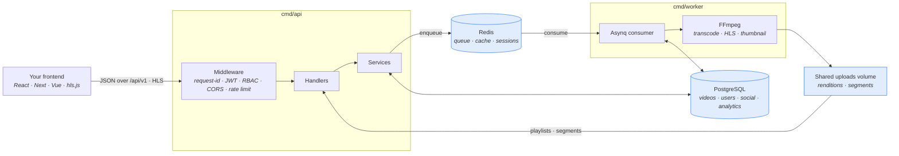
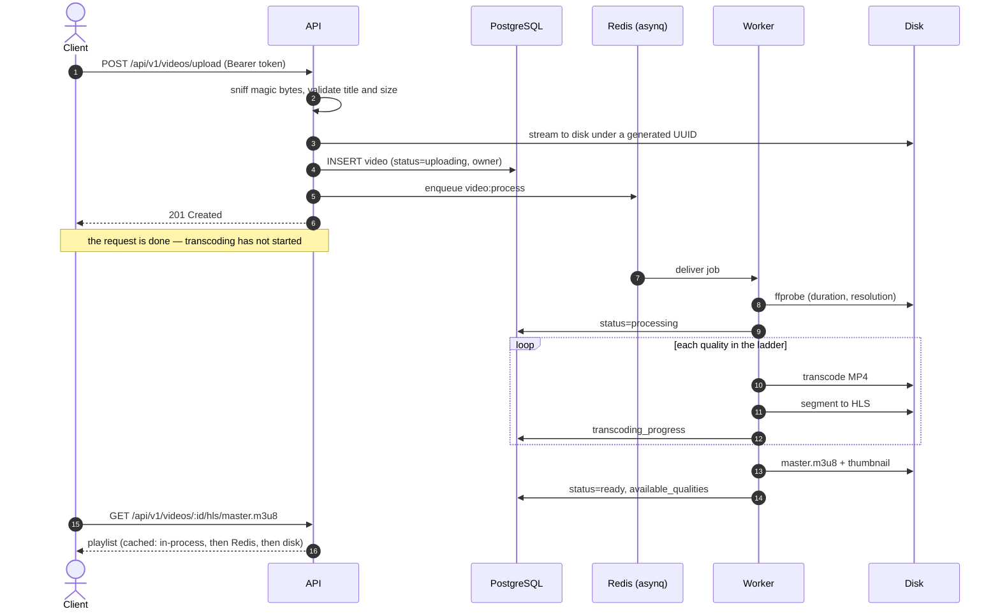
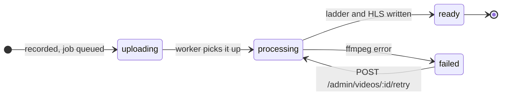
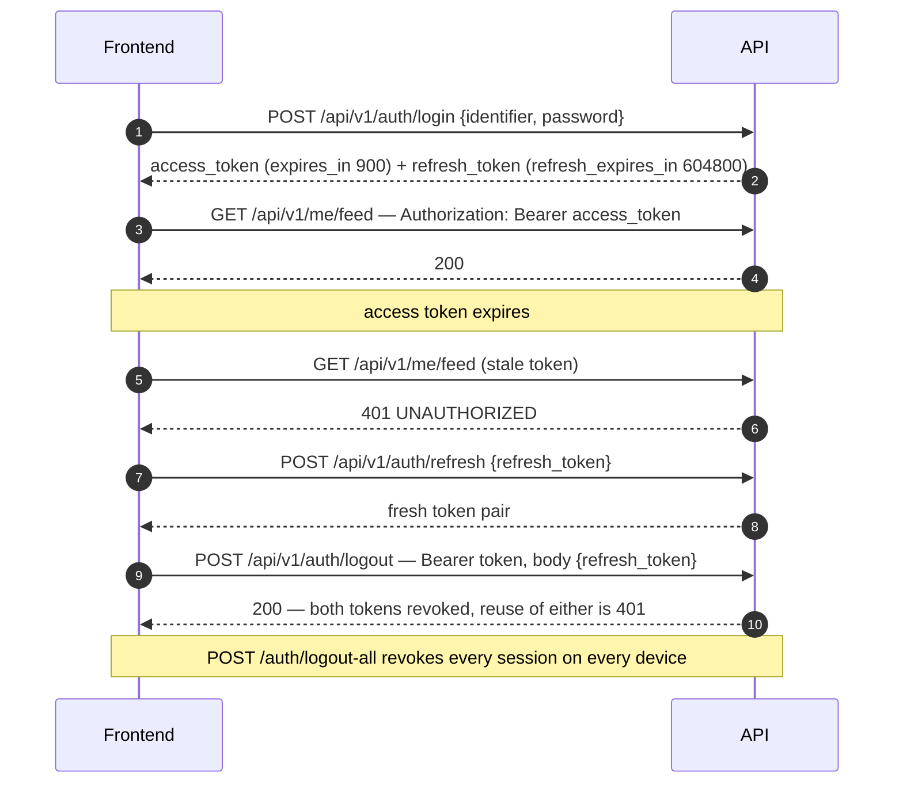
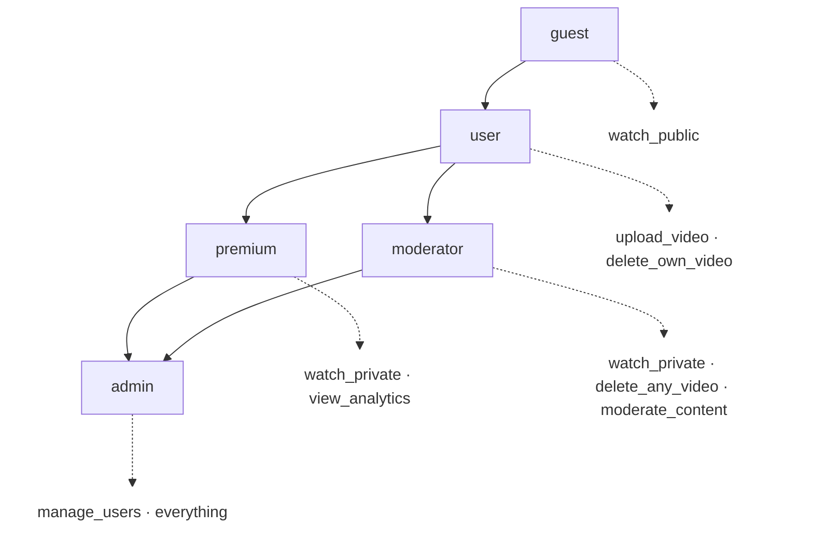
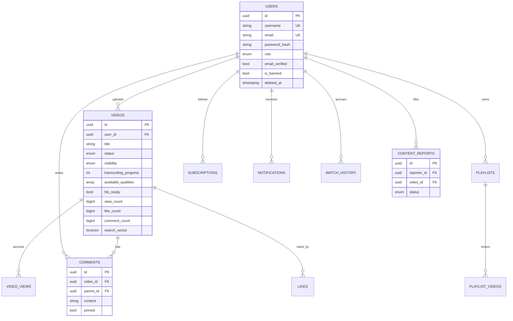

<div align="center">



<br>

[](https://github.com/Nuu-maan/video-streaming-service/actions/workflows/ci.yml)
[](https://go.dev)
[](https://www.postgresql.org)
[](https://redis.io)
[](https://ffmpeg.org)
[](LICENSE)

**A standalone video streaming backend in Go.** Host it anywhere, point any
frontend at it. Upload over HTTP, transcode off the request path, serve as
HLS with adaptive bitrate — plus accounts, comments, playlists, subscriptions,
search, and moderation, all over a JSON API.

</div>

---

## It is an API server

You host it, and a separate frontend project — React, Next, Vue, a mobile app,
`curl` — talks to it from another origin. There is no coupling to any UI.

- **Base URL:** `https://your-host/api/v1` — the canonical, versioned prefix.
  Bare `/api` still works as a legacy alias for the identical routes.
- **Auth:** JWT bearer tokens. Send `Authorization: Bearer <access_token>`.
- **Responses:** every JSON endpoint uses one envelope:

```jsonc
// success                                   // error
{ "success": true, "data": { ... } }         { "success": false,
                                               "error": { "code": "NOT_FOUND",
// lists (every list endpoint, /search too)              "message": "video not found" } }
{ "success": true, "data": [ ... ],
  "pagination": { "total": 42, "page": 1, "limit": 20,
                  "total_pages": 3, "has_next": true, "has_previous": false } }
```

Calling it from TypeScript is ordinary `fetch`:

```ts
const API = "https://api.example.com/api/v1";

// Login takes an *identifier* — a username OR an email — not "username".
const res = await fetch(`${API}/auth/login`, {
  method: "POST",
  headers: { "Content-Type": "application/json" },
  body: JSON.stringify({ identifier: "alice", password: "Str0ng!Passw0rd" }),
});
const { success, data, error } = await res.json();
if (!success) throw new Error(`${error.code}: ${error.message}`);

// data: { access_token, refresh_token, token_type: "Bearer",
//         expires_in: 900, refresh_expires_in: 604800, user: {...} }
const videos = await fetch(`${API}/videos?page=1&limit=20`, {
  headers: { Authorization: `Bearer ${data.access_token}` },
}).then(r => r.json());
```

Playback is standard HLS. A ready video carries computed `hls_url` and
`thumbnail_url` fields — feed the former to hls.js (or a native player):

```js
import Hls from "hls.js";
new Hls().loadSource(`${API}/videos/${id}/hls/master.m3u8`);
// Public and unlisted videos stream with no token. For a private video the
// owner must attach the bearer token, e.g. hls.js's xhrSetup hook.
```

And hosting is two Docker images plus the infrastructure they need:

```bash
cp .env.example .env    # set DB_PASSWORD, JWT_SECRET, CORS_ALLOWED_ORIGINS
docker compose -f docker-compose.prod.yml up -d --build
```

Details on each of these below — [CORS](#cors-a-frontend-on-another-origin),
[auth lifecycle](#authentication), the [endpoint tables](#api), and
[production hosting](#hosting).

The full contract lives in three places, kept in sync with the route table:

- **[`docs/openapi.yaml`](docs/openapi.yaml)** — OpenAPI 3.1 spec of every
  operation, schema, and error code. A running server serves it at
  `/openapi.yaml` and renders it as a browsable reference at **`/docs`**.
- **[`clients/typescript`](clients/typescript)** — a typed, zero-dependency
  TypeScript client (`createClient`) with automatic token refresh, upload
  progress, and media-URL helpers. Its README is a five-minute frontend
  quickstart.

---

## How it works

A video is uploaded, validated, and recorded — then the request returns. Nothing
slow happens on the request path. A background worker picks the job off Redis,
probes the file, transcodes it into a quality ladder, segments each rendition
into HLS, and marks the video ready.

<div align="center">
  
</div>

### Architecture

Two binaries share one `internal/` tree. They never call each other: they
communicate only through Redis, a shared PostgreSQL database, and a shared
uploads directory.



### The upload, end to end



### Video lifecycle



---

## Authentication

Login returns a short-lived access token (15 minutes) and a long-lived refresh
token (7 days). The two are not interchangeable: a refresh token presented as
API credentials is a `401`, and an access token presented at `/auth/refresh`
is a `401`. Logout actually revokes — revocation is checked in Redis on every
authenticated request, not just left to expiry.



### Roles and permissions

Every write is authenticated; admin routes also require a permission. Roles
map to permission sets in [`internal/domain/role.go`](internal/domain/role.go).



New accounts get `user`. Promotion is no longer a raw SQL exercise — the
`cmd/admin` CLI reads the same `DB_*` environment as the server:

```bash
# locally
make admin ARGS='promote --username alice --role admin'
go run ./cmd/admin create --username root --email root@example.com --password '...' --role admin

# in the production stack (the CLI ships inside the api image)
docker compose -f docker-compose.prod.yml exec api admin promote --username alice --role admin
```

`create` accepts the password via the `ADMIN_PASSWORD` environment variable to
keep it out of shell history, and marks the account email-verified — there is
no verification link to click at a terminal.

---

## CORS: a frontend on another origin

Your frontend runs on a different origin, so the browser enforces CORS — and
the failure mode is silent and confusing, which makes it worth spelling out:

- **Allowlist your frontend's origin** in `CORS_ALLOWED_ORIGINS`
  (comma-separated, exact origins, e.g. `https://app.example.com`). If it is
  missing, every `fetch` from that origin fails with an opaque network error —
  the request often reaches the server and succeeds, but the browser refuses
  to hand your script the response. `*` is refused in production: the API
  sends credentials, and wildcard-plus-credentials is rejected by browsers
  anyway.
- `Authorization`, `Content-Type`, and `Range` are always allowed as request
  headers, even if omitted from `CORS_ALLOWED_HEADERS` — without them the API
  cannot be consumed cross-origin at all.
- The API exposes `Content-Length`, `Content-Range`, `Accept-Ranges`, and
  `X-Request-ID` to cross-origin scripts. Without the first three, a player on
  another origin cannot read the result of its own `Range` requests — video
  plays, but seeking in hls.js and the MP4 fallback silently breaks.
- Preflight `OPTIONS` is answered on every path, including routes that only
  register `GET` — pinned by a test, because an unanswered preflight blocks
  the real call.

---

## Quick start (development)

**Requires** Go 1.25+, Docker, FFmpeg (`ffmpeg` and `ffprobe` on `PATH`), and Make.

```bash
cp .env.example .env      # defaults work as-is for local development
make install-tools        # air, templ, golang-migrate
make docker-up            # PostgreSQL, Redis, MinIO, Prometheus, Grafana
make migrate-up           # apply the schema

make dev                  # terminal 1 — API, hot reload
make worker               # terminal 2 — transcoding worker
```

> **Both processes are required.** With no worker running, uploads are accepted
> and then sit in `uploading` forever.

In this mode only infrastructure is containerized; the Go processes run on the
host. For running the whole thing in containers, see [Hosting](#hosting).

### Try it

The supported way to poke the API by hand is the console at:

```
http://localhost:8080/static/console.html
```

It drives register/login/refresh/logout, upload with a live transcoding
progress bar, listing, and the admin endpoints. Or from the shell:

```bash
TOKEN=$(curl -s -X POST localhost:8080/api/v1/auth/register \
  -H 'Content-Type: application/json' \
  -d '{"username":"alice","email":"alice@example.com","password":"Str0ng!Passw0rd"}' \
  | jq -r .data.access_token)

curl -X POST localhost:8080/api/v1/videos/upload \
  -H "Authorization: Bearer $TOKEN" \
  -F video=@clip.mp4 -F title='My clip'
```

---

## API

All paths below are relative to **`/api/v1`** (the bare `/api` alias serves the
same handlers). 🔒 requires a bearer token; 🔓 means a token is optional but
changes what you see.

Lists take `?page` (default 1) and `?limit` (default 20, max 100) and answer in
the paginated envelope — including `/search`. The exceptions that return a
plain array are noted.

### Auth and account

| Method | Endpoint | | Notes |
|---|---|---|---|
| `POST` | `/auth/register` | | `username`, `email`, `password` → token pair |
| `POST` | `/auth/login` | | `identifier` (username **or** email), `password` → token pair |
| `POST` | `/auth/refresh` | | `{"refresh_token": "..."}` → new token pair |
| `GET` | `/auth/me` | 🔒 | |
| `POST` | `/auth/logout` | 🔒 | Revokes the access token; include `refresh_token` in the body to revoke it too |
| `POST` | `/auth/logout-all` | 🔒 | Revokes every session on every device |
| `POST` | `/auth/verify-email/send` | 🔒 | (Re)send the verification mail |
| `POST` | `/auth/verify-email` | | `{"token": "..."}` |
| `POST` | `/auth/forgot-password` | | Always `200` with the same body — no email enumeration |
| `POST` | `/auth/reset-password` | | `{"token": "...", "password": "..."}` |
| `POST` | `/me/change-password` | 🔒 | `current_password`, `new_password` |

### Videos

| Method | Endpoint | | Notes |
|---|---|---|---|
| `GET` | `/videos` | 🔓 | `?search` `?status`; `?mine=true` with a token lists your own, all visibilities |
| `GET` | `/videos/:id` | 🔓 | Private videos `404` for non-owners |
| `GET` | `/videos/:id/status` | 🔓 | Transcoding progress, `available_qualities` |
| `POST` | `/videos/upload` | 🔒 | `upload_video`. Multipart: `video`, `title`, `description`, `visibility` |
| `DELETE` | `/videos/:id` | 🔒 | Owner, or `delete_any_video` |

### Streaming

Raw media, never the JSON envelope. Token optional; private videos `404` for
non-owners on every route here.

| Method | Endpoint | Notes |
|---|---|---|
| `GET` | `/videos/:id/hls/master.m3u8` | Variant playlist |
| `GET` | `/videos/:id/hls/:quality/playlist.m3u8` | Media playlist — `360p`, `480p`, `720p`, `1080p` |
| `GET` | `/videos/:id/hls/:quality/:segment` | `.ts` segment, immutable cache headers, `Range` → `206` |
| `GET` | `/videos/:id/stream/:quality` | Progressive MP4 fallback, honours `Range` |
| `GET` | `/videos/:id/thumbnail` | JPEG poster, same visibility check as the video |

### Engagement

| Method | Endpoint | | Notes |
|---|---|---|---|
| `POST` | `/videos/:id/view` | 🔓 | Explicit view recording — playback does not auto-count. Deduped in Redis: `201` counted, `200` repeat. Anonymous callers must send `session_id` in the JSON body |
| `POST` | `/videos/:id/progress` | 🔒 | `position`, `duration`, `completed` — resume point |
| `GET` | `/me/history` | 🔒 | Watch history, most recent first |
| `DELETE` | `/me/history` | 🔒 | Clear all history |
| `DELETE` | `/me/history/:videoId` | 🔒 | Remove one entry |

### Social

| Method | Endpoint | | Notes |
|---|---|---|---|
| `PUT` | `/videos/:id/like` | 🔒 | `{"is_like": true}` or `false` (dislike) — the key must be present |
| `GET` / `DELETE` | `/videos/:id/like` | 🔒 | Read / clear your rating |
| `GET` | `/videos/:id/comments` | | Top-level comments, pinned first |
| `POST` | `/videos/:id/comments` | 🔒 | `content` (1–10000 chars), optional `parent_id` for a reply |
| `GET` | `/comments/:id/replies` | | Oldest first |
| `PATCH` | `/comments/:id` | 🔒 | Author only |
| `DELETE` | `/comments/:id` | 🔒 | Author, the video's owner, or `moderate_content` |
| `POST` / `DELETE` | `/users/:id/subscribe` | 🔒 | Idempotent; self-subscribe is a `400` |
| `GET` | `/users/:id/subscribers` | | |
| `POST` | `/playlists` | 🔒 | `title`, `description`, `visibility` |
| `GET` | `/playlists/:id` | 🔓 | Private playlists `404` for non-owners |
| `PATCH` / `DELETE` | `/playlists/:id` | 🔒 | Owner only |
| `POST` | `/playlists/:id/videos` | 🔒 | `{"video_id": "..."}`; duplicate is `409` |
| `DELETE` | `/playlists/:id/videos/:videoId` | 🔒 | |
| `GET` | `/playlists/:id/videos` | 🔓 | In position order |
| `PUT` / `DELETE` | `/videos/:id/watch-later` | 🔒 | Idempotent save / remove |
| `GET` | `/me/watch-later` · `/me/subscriptions` · `/me/playlists` | 🔒 | |
| `GET` | `/me/notifications` | 🔒 | `?unread=true` narrows |
| `GET` | `/me/notifications/unread-count` | 🔒 | For badge rendering |
| `POST` | `/me/notifications/read-all` · `/me/notifications/:id/read` | 🔒 | |

### Discovery

| Method | Endpoint | | Notes |
|---|---|---|---|
| `GET` | `/search` | | `q` required; `sort` (relevance\|newest\|views\|likes), `category`, `language`, `tags`, `min_duration`, `max_duration`. Paginated envelope |
| `GET` | `/search/suggest` | | Up to ten title suggestions — plain array |
| `GET` | `/videos/trending` | | `?window=24h\|7d\|30d` — plain array, not paginated |
| `GET` | `/videos/:id/related` | | Shared tags/category, topped up from trending — plain array |
| `GET` | `/categories` | | Categories in use with counts — plain array |
| `GET` | `/me/feed` | 🔒 | Videos from creators you subscribe to, newest first |

### Reports and admin

| Method | Endpoint | Permission |
|---|---|---|
| `POST` | `/reports` | any authenticated user — report a video, user, or comment |
| `POST` | `/admin/videos/:id/retry` | `moderate_content` — re-queue a `failed` video |
| `GET` | `/admin/queue/stats` · `/admin/workers` | `moderate_content` |
| `DELETE` | `/admin/videos/:id/cache` | `moderate_content` |
| `GET` | `/admin/reports/pending` | `moderate_content` |
| `POST` | `/admin/reports/:id/review` | `moderate_content`; `action=ban_user` additionally needs `manage_users` |
| `POST` | `/admin/users/:id/ban` · `/unban` | `manage_users` |
| `GET` | `/admin/analytics/…` | `view_analytics` |
| `GET` | `/admin/monitoring/…` | `manage_users` |

### Ops (outside `/api`)

| Method | Endpoint | Notes |
|---|---|---|
| `GET` | `/health` | `503` when PostgreSQL or Redis is unreachable — usable as a readiness probe |
| `GET` | `/metrics` | Prometheus exposition format (blocked at the edge by the production nginx) |
| `GET` | `/docs` | Self-contained HTML API reference, generated from the OpenAPI spec |
| `GET` | `/openapi.yaml` | The raw OpenAPI 3.1 document |

Error codes you will encounter: `VALIDATION_ERROR`, `UNAUTHORIZED`, `FORBIDDEN`,
`NOT_FOUND`, `ALREADY_EXISTS`, `USER_BANNED`, `DUPLICATE_REPORT`,
`VIDEO_NOT_READY`, `FILE_NOT_FOUND`, `PLAYLIST_NOT_FOUND`, `INTERNAL_ERROR`,
among others — always in the `error.code` field with a human-readable
`error.message` beside it.

---

## Hosting

The [`Dockerfile`](Dockerfile) is multi-stage with **two runtime targets** —
only the worker ships FFmpeg, so the API image stays small and carries no media
toolchain it never uses:

```bash
docker build --target api    -t video-streaming-api .
docker build --target worker -t video-streaming-worker .
# or: make docker-build
```

[`docker-compose.prod.yml`](docker-compose.prod.yml) runs the whole stack:
nginx → api, worker, PostgreSQL, Redis, MinIO. All configuration comes from
`.env`; no secret is baked into an image.

```bash
cp .env.example .env      # set real secrets — see the checklist below
docker compose -f docker-compose.prod.yml up -d --build
```

Things the compose file gets right that are easy to get wrong rebuilding it:

- **The `api` and `worker` containers share one `uploads` volume. This is
  load-bearing.** The worker writes HLS playlists and segments there and the
  API serves them; put the two on separate filesystems and every playlist
  request 404s and nothing streams.
- **Migrations run as a one-shot `migrate` service**, not inside the API
  process — with N API replicas, every replica racing `migrate up` on boot is
  a recipe for duplicate-DDL failures. The API and worker wait for it to exit
  0 before starting.
- **nginx ([`deploy/nginx/api.conf`](deploy/nginx/api.conf)) is the only
  public entrypoint.** It streams uploads through without spooling them to its
  own disk, adds a coarse per-IP rate-limit backstop, and blocks `/metrics`
  from the internet. It deliberately does **not** mount the uploads volume —
  serving those files directly would bypass the API's access control and hand
  out private videos and raw originals to anyone who could guess a path. TLS
  termination is out of scope: put a TLS-terminating proxy or load balancer in
  front of port 80.
- The admin CLI ships inside the api image, so bootstrapping the first admin
  is `docker compose -f docker-compose.prod.yml exec api admin create ...` —
  no psql required.

Before going live, in `.env`:

| Key | Why |
|---|---|
| `JWT_SECRET` | The default is public in this repository; production refuses to boot with it |
| `DB_PASSWORD` | Interpolated into the migrate service's URL — percent-encode `@ : / ? #` |
| `CORS_ALLOWED_ORIGINS` | Your frontend's origin(s) — see [CORS](#cors-a-frontend-on-another-origin) |
| `SERVER_TRUSTED_PROXIES` | The compose network range, or rate limiting keys every request to nginx's address |
| `MAIL_FRONTEND_BASE_URL` | Where verification and reset links point — your **frontend's** origin, not the API's |
| `SMTP_HOST` | Empty means mail is written to the application log instead of sent |

---

## Data model

Eleven `golang-migrate` migrations. Core tables:



Full-text search runs on the `search_vector` GIN index, maintained by a
trigger. The `view_count` / `like_count` / `comment_count` denormalizations are
kept consistent by database triggers.

---

## Configuration

Environment-driven. [`.env.example`](.env.example) lists exactly the keys
`internal/config` reads — nothing aspirational.

Production (`ENVIRONMENT=production`) is validated harder and **refuses to boot**
when:

| Condition | Why |
|---|---|
| `JWT_SECRET` is the dev default, or shorter than 32 chars | The default is public in this repository |
| `CORS_ALLOWED_ORIGINS` is `*` | Wildcard plus credentials is rejected by browsers, and unsafe |
| `DB_SSLMODE=disable` | Plaintext database traffic |
| `SMTP_ALLOW_INSECURE=true` | Cleartext mail delivery is for local relays only |

---

## Security posture

What is actually enforced, because these were all real holes at some point:

- **Private videos 404, never 403** — for non-owners, on the metadata routes
  and on every media route (playlists, segments, MP4, thumbnail). A `403`
  would confirm the video exists.
- **No static route over the uploads directory.** One used to exist, and it
  served every raw original and every private video's segments to anyone with
  a path — bypassing all access checks. Media is served exclusively through
  `/api/v1/videos/:id/...`, which resolves the video and checks who is asking.
  The production nginx repeats the same decision: it proxies media rather than
  mounting the volume.
- **Token revocation is real.** Logout revokes the presented tokens in Redis
  and revocation is checked on every authenticated request; `logout-all` kills
  every session. What happens when Redis is down is explicit config
  (`AUTH_REVOCATION_FAIL_OPEN`, default closed).
- **No email enumeration.** `forgot-password` answers `200` with the same body
  whether or not the address is registered; login returns the same `401` for
  an unknown account and a wrong password.
- **Sensitive fields never serialize.** Password hashes, reset and
  verification tokens are `json:"-"`. Server-side storage paths are withheld
  too — clients only ever see the computed `hls_url` and `thumbnail_url`.
- **Client IPs are not spoofable by default.** `X-Forwarded-For` is honoured
  only from proxies listed in `SERVER_TRUSTED_PROXIES` (empty by default), so
  the rate limiter and view dedupe key on the real connection address.

---

## Development

```bash
make check     # gofmt + go vet + go test -race   <- what CI runs
make test      # tests with an HTML coverage report
make lint      # golangci-lint
make templ     # regenerate templates after editing web/templates/*.templ
```

Tests cover the domain, RBAC, JWT, password handling, config validation, the
auth and CORS middleware, storage, cache eviction, and the routing stack itself
(both the `/api/v1` and `/api` mounts, and preflight on every path) — including
regression tests for bugs that actually shipped: an MP4 sniffer that rejected
valid MP4s, and a cache counter that evicted live entries.

---

## Known gaps

Stated plainly, because a README that oversells is worse than no README.

| Area | Status |
|---|---|
| **No CDN** | Every HLS segment is served by the Go process (proxied by nginx). Fine at small scale; at real segment volume you want a CDN, or at least nginx `X-Accel-Redirect` — which needs a handler change, not a config tweak. |
| **Object storage** | `internal/storage` is a proper interface with a working MinIO backend, but `MINIO_ENABLED` defaults to `false` and the local filesystem remains the default path. Turning it on is supported, not battle-tested. |
| **Recommendations** | `/videos/:id/related` is content-based — shared tags and category, topped up from trending. It is not collaborative filtering and this README will not call it a recommendation engine. |
| **Rate limiting** | Fine-grained limits are enforced in-process against Redis, and fail open (with a log line) if Redis is unreachable. The production nginx adds only a coarse per-IP backstop; there is no distributed edge limiting. |
| **Server-rendered pages** | The Templ pages at `/`, `/videos`, `/videos/:id` still work but are vestigial next to the API. The supported way to poke the API by hand is `/static/console.html`. |

---

<div align="center">
<sub>MIT licensed.</sub>
</div>
