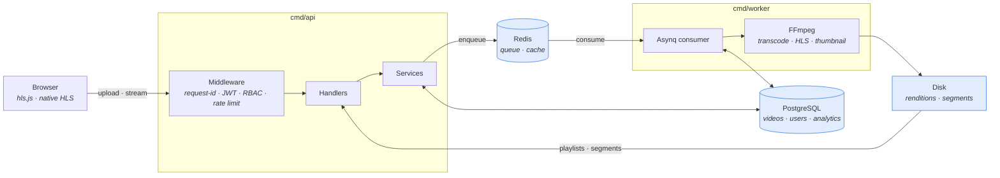
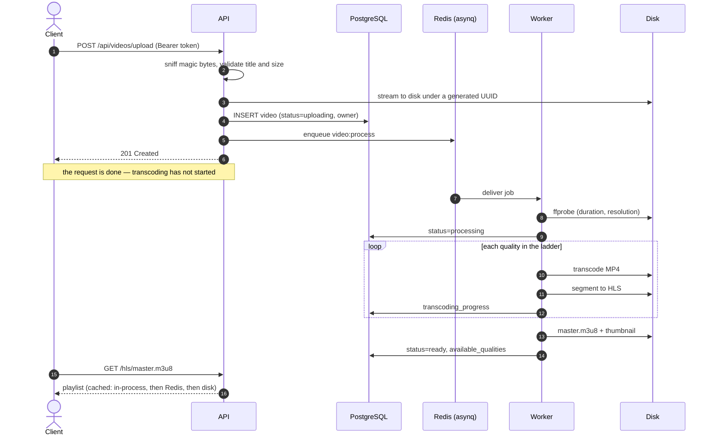
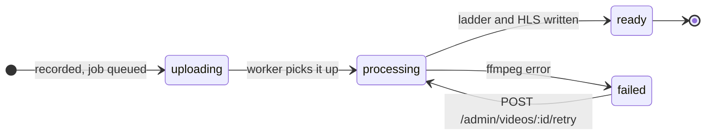
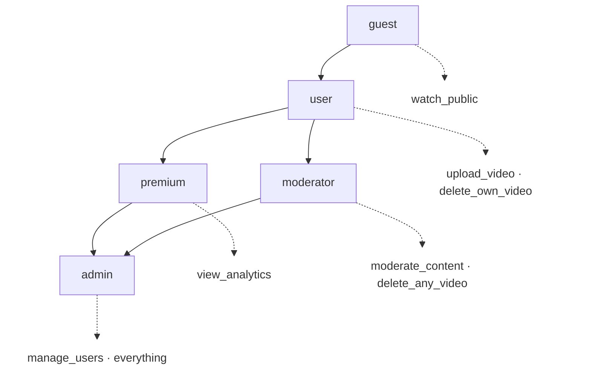
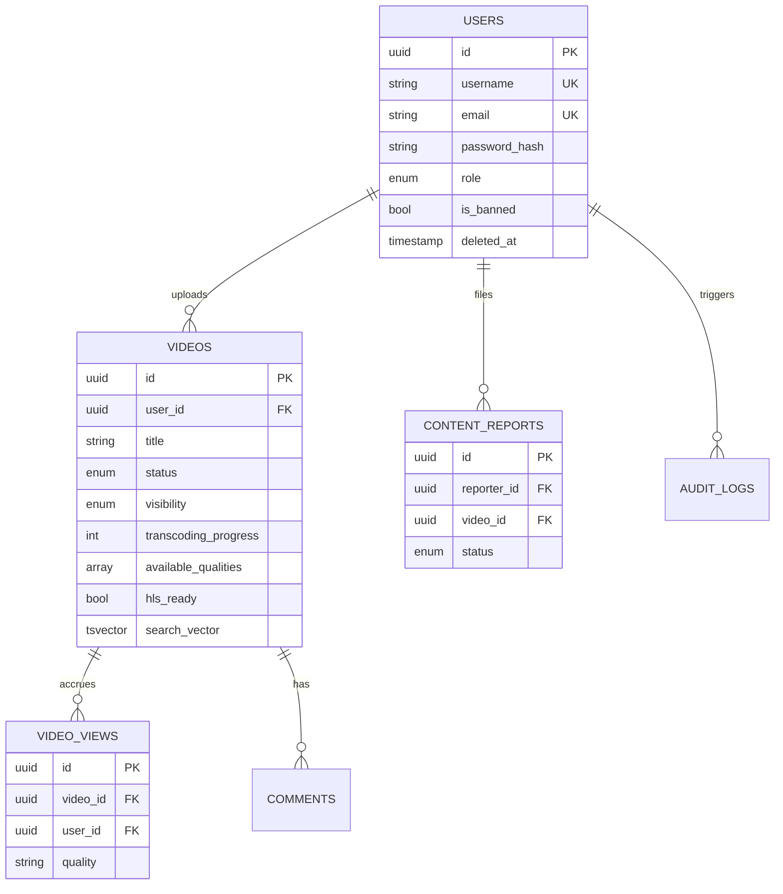

<div align="center">


<br>

[](https://github.com/Nuu-maan/video-streaming-service/actions/workflows/ci.yml)
[](https://go.dev)
[](https://www.postgresql.org)
[](https://redis.io)
[](https://ffmpeg.org)
[](LICENSE)

**A video platform in Go.** Upload over HTTP, transcode off the request path,
serve as HLS with adaptive bitrate.

</div>

---

## How it works

A video is uploaded, validated, and recorded — then the request returns. Nothing
slow happens on the request path. A background worker picks the job off Redis,
probes the file, transcodes it into a quality ladder, segments each rendition
into HLS, and marks the video ready.

<div align="center">
  
</div>

### Architecture

Two binaries share one `internal/` tree. They never call each other: they
communicate only through Redis and a shared PostgreSQL database.



### The upload, end to end



### Video lifecycle



---

## Quick start

**Requires** Go 1.25+, Docker, FFmpeg (`ffmpeg` and `ffprobe` on `PATH`), and Make.

```bash
cp .env.example .env      # defaults work as-is for local development
make install-tools        # air, templ, golang-migrate
make docker-up            # PostgreSQL, Redis, MinIO, Prometheus, Grafana
make migrate-up           # apply the schema

make dev                  # terminal 1 — API, hot reload
make worker               # terminal 2 — transcoding worker
```

> **Both processes are required.** With no worker running, uploads are accepted
> and then sit in `uploading` forever.

Only infrastructure is containerized; the Go processes run on the host.

### Try it

An API console that drives the whole service — register, log in, upload with a
live progress bar, stream, and hit the admin endpoints — is served at:

```
http://localhost:8080/static/console.html
```

Or from the shell:

```bash
TOKEN=$(curl -s -X POST localhost:8080/api/auth/register \
  -H 'Content-Type: application/json' \
  -d '{"username":"alice","email":"alice@example.com","password":"Str0ng!Passw0rd"}' \
  | jq -r .data.access_token)

curl -X POST localhost:8080/api/videos/upload \
  -H "Authorization: Bearer $TOKEN" \
  -F video=@clip.mp4 -F title='My clip'
```

---

## Authentication

Every write is authenticated with a JWT bearer token; every admin route also
requires a permission. Roles map to permission sets in
[`internal/domain/role.go`](internal/domain/role.go).



New accounts get `user`. Promoting to `admin` is a database operation today —
there is no endpoint for it:

```sql
UPDATE users SET role = 'admin' WHERE username = 'alice';
```

---

## API

🔒 requires a bearer token.

### Public

| Method | Endpoint | | Notes |
|---|---|---|---|
| `GET` | `/health` | | `503` when PostgreSQL or Redis is unreachable |
| `GET` | `/metrics` | | Prometheus exposition format |
| `POST` | `/api/auth/register` | | |
| `POST` | `/api/auth/login` | | Accepts a username **or** an email |
| `POST` | `/api/auth/refresh` | | |
| `GET` | `/api/auth/me` | 🔒 | |
| `GET` | `/api/videos` | | Public videos. `?mine=true` with a token lists your own |
| `GET` | `/api/videos/:id` | | |
| `GET` | `/api/videos/:id/status` | | Transcoding progress |

### Streaming

| Method | Endpoint | Notes |
|---|---|---|
| `GET` | `/api/videos/:id/hls/master.m3u8` | Variant playlist |
| `GET` | `/api/videos/:id/hls/:quality/playlist.m3u8` | Media playlist |
| `GET` | `/api/videos/:id/hls/:quality/:segment` | `.ts` segment |
| `GET` | `/api/videos/:id/stream/:quality` | MP4 fallback, honours `Range` |

### Authenticated

| Method | Endpoint | Permission |
|---|---|---|
| `POST` | `/api/videos/upload` | `upload_video` |
| `DELETE` | `/api/videos/:id` | owner, or `delete_any_video` |
| `POST` | `/api/reports` | any authenticated user |

### Admin

| Method | Endpoint | Permission |
|---|---|---|
| `POST` | `/api/admin/videos/:id/retry` | `moderate_content` |
| `GET` | `/api/admin/queue/stats` · `/workers` | `moderate_content` |
| `DELETE` | `/api/admin/videos/:id/cache` | `moderate_content` |
| `GET` | `/api/admin/reports/pending` | `moderate_content` |
| `POST` | `/api/admin/reports/:id/review` | `moderate_content` |
| `POST` | `/api/admin/users/:id/ban` · `/unban` | `manage_users` |
| `GET` | `/api/admin/analytics/…` | `view_analytics` |
| `GET` | `/api/admin/monitoring/…` | `manage_users` |

---

## Data model

Ten `golang-migrate` migrations. Core tables:



Full-text search runs on the `search_vector` GIN index, maintained by a trigger.

---

## Configuration

Environment-driven. [`.env.example`](.env.example) lists exactly the keys
`internal/config` reads — nothing aspirational.

Production (`ENVIRONMENT=production`) is validated harder and **refuses to boot**
when:

| Condition | Why |
|---|---|
| `JWT_SECRET` is the dev default, or shorter than 32 chars | The default is public in this repository |
| `CORS_ALLOWED_ORIGINS` is `*` | Wildcard plus credentials is rejected by browsers, and unsafe |
| `DB_SSLMODE=disable` | Plaintext database traffic |

---

## Development

```bash
make check     # gofmt + go vet + go test -race   <- what CI runs
make test      # tests with an HTML coverage report
make lint      # golangci-lint
make templ     # regenerate templates after editing web/templates/*.templ
```

Tests cover the domain, RBAC, JWT, password handling, config validation, the
auth middleware, and cache eviction — including regression tests for bugs that
actually shipped: an MP4 sniffer that rejected valid MP4s, and a cache counter
that evicted live entries.

---

## Known gaps

Stated plainly, because a README that oversells is worse than no README.

| Area | Status |
|---|---|
| **Object storage** | `internal/storage` has a working MinIO client and `MINIO_*` config exists, but upload, transcoding, and streaming all still use the local filesystem. `MINIO_ENABLED` defaults to `false`. Migrating the pipeline is a real change, not a flag flip. |
| **Social features** | Migration 9 creates `subscriptions`, `likes`, `comments`, `playlists`, `watch_history`, `notifications`. No endpoint touches them. |
| **View counting** | Nothing increments `view_count` or `like_count` yet, so the analytics endpoints report zeros. |
| **Built-in upload page** | The Templ page at `/` posts via htmx with no `Authorization` header, so it returns `401`. Use the API console until it gains a login flow. |
| **Email** | Verification and password-reset columns, tokens, and domain methods exist. There is no delivery mechanism and no endpoints. |
| **Containerization** | No `Dockerfile` and no production compose file. `docker-compose.yml` brings up infrastructure only. |
| **nginx** | `nginx.conf` fronts MinIO, not the API — so its `limit_req` rules never see an API request. Rate limiting is enforced in-process instead. |

---

<div align="center">
<sub>MIT licensed.</sub>
</div>
